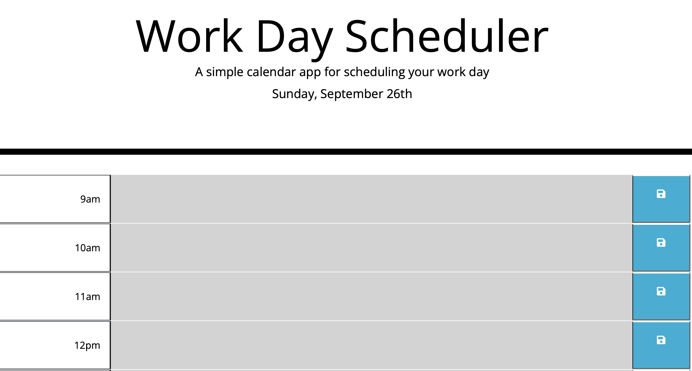

# Day-Planner

## Description

This application is a daily planner that allows people to enter their schedule for the work day.

At the top of the page the current day and date is displayed, while shown below are timeblocks for every hour from 9am to 5pm are shown below. Each timeblock for that day is colour coded to indicate whether it is in the past, present, or future.

## Access

The following link: https://sophiekdj.github.io/Day-Planner/

## Usage

The page looks like this:

When the blue save button on the right is pressed, it saves the entered text into the local storage. This means the information is unaltered when the page is reloaded.
